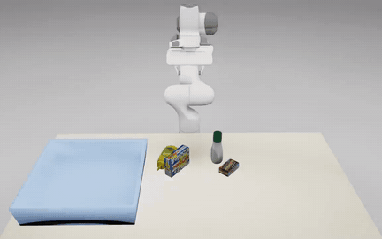
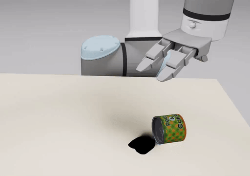
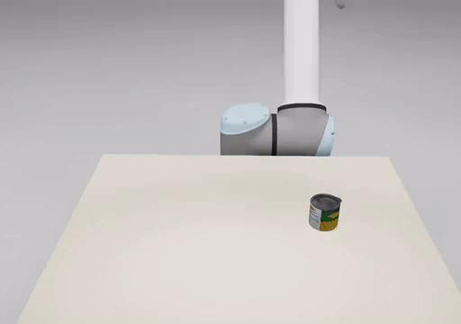
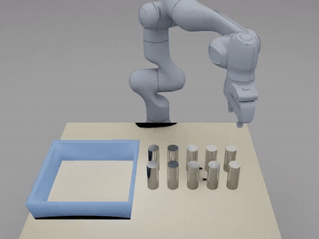

# End-to-End Demos

This `README` gives examples of using GraspGenX in a end-to-end application, using a Motion Planner (curobo) and evaluated on a physics simulator (Newton). One can also use it to generate Synthetic Data Generation (SDG) for Vision-Language-Action (VLA) training. In these examples, the simulator and GraspGenX model uses the complete object mesh point cloud, but it can be extended to using using RGB-D observations from the simulator and using SAM segmentation.

**GraspGenX** predicts grasps on each object → **cuRobo** plans a
collision-free arm trajectory to a collision-free grasp → **Newton/MuJoCo**
replays the trajectory under gravity + contacts (PD-controlled joints) →
renders an **MP4** and exports a **USD** animation.

Three example demos ship out of the box (a Franka Panda, plus a UR10e +
arx_x5); see [The three demos](#the-three-demos).

   

---

## Install

The pipeline needs a heavier sim/planning stack than the base GraspGenX
inference install. It lives in an optional extra:

```bash
uv sync                    # base GraspGenX (inference)
uv sync --extra end2end    # + cuRobo, Newton
python end2end/setup_end2end_deps.py   # cuRobo assets into ext/ + UR10e arx_x5 URDF
```

`setup_end2end_deps.py` clones the full cuRobo source (with its git-LFS robot
meshes) into `ext/curobo`, re-installs cuRobo editable from it, and builds the
merged UR10e + arx_x5 URDF that example 3 needs (a gitignored artifact under
`end2end/curobo_assets/`). It's idempotent — re-run it any time.

---

## The three demos

Run every command **from the repo root** (the env YAMLs use repo-relative
mesh paths). Each writes a `trajectory.json` you then render / export
([next section](#render--export-to-usd)).

| # | Demo | Robot | Scene | Task |
|---|---|---|---|---|
| 1 | Franka — single pick → bin | `robots/franka_panda.yaml` | `envs/single_bin_demo.yaml` | `clutter_pick_and_drop` |
| 2 | Franka — 3-object clutter → bin | `robots/franka_panda.yaml` | `envs/franka_clutter3_demo.yaml` | `clutter_pick_and_drop` |
| 3 | UR10e + arx_x5 — pick & lift | `robots/ur10e_arx_x5.yaml` | `envs/tabletop_single_nobin.yaml` | `pick_and_lift` |

**1 — Franka, single object → bin** (ChocolatePudding):

```bash
PYOPENGL_PLATFORM=egl PYGLET_HEADLESS=true uv run python end2end/e2e_grasp_demo.py \
  --robot_config end2end/robots/franka_panda.yaml \
  --env_config   end2end/envs/single_bin_demo.yaml \
  --task clutter_pick_and_drop --playback_mode dynamic --no-viser \
  --num_grasps 200 --topk 80 --grasp_threshold 0.7 --planner graspmoe \
  --seed 0 --export-trajectory end2end/runs/franka_single/trajectory.json
```

**2 — Franka, 3-object clutter → bin** (GranolaBars + Mustard + ChocolatePudding):

```bash
PYOPENGL_PLATFORM=egl PYGLET_HEADLESS=true uv run python end2end/e2e_grasp_demo.py \
  --robot_config end2end/robots/franka_panda.yaml \
  --env_config   end2end/envs/franka_clutter3_demo.yaml \
  --task clutter_pick_and_drop --playback_mode dynamic --no-viser \
  --num_grasps 200 --topk 80 --grasp_threshold 0.7 --planner graspmoe \
  --max_retries_per_object 2 --seed 0 \
  --export-trajectory end2end/runs/franka_clutter3/trajectory.json
```

**3 — UR10e + arx_x5, pick & lift** (no bin; object mesh passed on the CLI):

```bash
PYOPENGL_PLATFORM=egl PYGLET_HEADLESS=true uv run python end2end/e2e_grasp_demo.py \
  --robot_config end2end/robots/ur10e_arx_x5.yaml \
  --env_config   end2end/envs/tabletop_single_nobin.yaml \
  --mesh_file    assets/sample_data/hope_objects/GranolaBars.obj \
  --task pick_and_lift --playback_mode dynamic --no-viser \
  --num_grasps 200 --topk 80 --grasp_threshold 0.7 --planner graspmoe \
  --hold_after_close_frames 150 --seed 0 \
  --export-trajectory end2end/runs/arx_lift/trajectory.json
```

---

## Render & export to USD

Both renderers consume the exported `trajectory.json` and are decoupled from
the sim, so you can re-render without re-simulating.

### MP4 preview

```bash
# Low-res, textureless (fast — ~4–6x faster than textured on EGL):
PYOPENGL_PLATFORM=egl uv run python end2end/render_trajectory_mp4.py \
  --trajectory end2end/runs/franka_clutter3/trajectory.json \
  --output end2end/runs/franka_clutter3/demo.mp4 \
  --resolution 320x240 --no-texture
```

Useful flags:
- `--object-color r,g,b` — paint every object one uniform color (floats in
  `[0,1]` or `0-255`).
- `--object-metallic` — shiny metallic PBR material (high metallic, low
  roughness).
- `--show-grasps` — overlay predicted + chosen grasps on every frame.
- `--frame-skip N`, `--fps N`, `--resolution WxH`.

### USD animation (for Isaac Sim / Omniverse)

```bash
# Textured objects + ground + lights + camera. Keep the sibling textures/
# folder next to the .usda when you move it.
PYOPENGL_PLATFORM=egl uv run python end2end/export_trajectory_usd.py \
  --trajectory end2end/runs/franka_clutter3/trajectory.json \
  --output end2end/runs/franka_clutter3/demo.usda
```

Useful flags:
- `--no-textured` — matte color instead of baking the object texture.
- `--metallic [--metallic-color r,g,b]` — bind a shiny metallic material to
  all objects (renders as polished metal in Isaac Sim RTX); default brushed
  silver.

The exported `.usda` has **baked geometry** (self-contained) and writes object
textures into a sibling `textures/` folder, so the `.usda` + `textures/` pair
is portable.

---

## How it works

1. **`scene_builder.build_clutter_scene`** — reads the env YAML, places the
   objects collision-free (seeded random xy + yaw), builds the cuRobo
   collision world and the visual meshes.
2. **`run_graspgen`** (`e2e_grasp_demo.py`) — samples surface points per
   object, runs the GraspGenX sampler, returns world-frame grasps + scores.
3. **`clutter_task`** — a FIFO queue with per-object retries. Per object it
   scores grasps for collision-freedom (gripper mesh vs table/bin/neighbors/
   target, fcl) and **feeds cuRobo only the collision-free grasps**; cuRobo
   `plan_grasp` returns approach→grasp→lift, then transport→drop into the bin.
4. **`dynamic_playback`** (Newton) — replays the planned trajectory with PD
   joint control under gravity + contacts; checks the object actually lands
   in the bin (slip check). One Newton model persists across all picks.
5. **`render_trajectory_mp4`** / **`export_trajectory_usd`** — consume the
   exported `trajectory.json` (decoupled from the sim).

---

## Outputs

| File | What |
|---|---|
| `trajectory.json` | Full animation: per-frame robot link transforms + object poses, static table/bin, camera. Source for both renderers. |
| `*.mp4` | Quick preview. `--no-texture --resolution 320x240` is fastest. |
| `*.usda` (+ `textures/`) | Textured, lit, camera'd USD animation for IsaacSim / Omniverse. |

---

## Config layers

- **`robots/<name>.yaml`** — arm + gripper combo: cuRobo robot config, tool
  frame, default joint config, `grasp_to_tool_transform`, robot base pose,
  GraspGenX gripper name + (optional) checkpoint dir, and dynamic PD gains.
  Path fields (`urdf_path`, `asset_root_path`) use `${CUROBO_ASSETS}` /
  `${E2E}` tokens resolved by `end2end/paths.py` — no absolute paths.
- **`envs/<name>.yaml`** — table/bin assets, `object_slots` (mesh +
  `mesh_scale` + optional `pre_rotation` + placement), `placement_region`,
  and the render camera.

Add a new object → add an `object_slots` entry. New robot → new `robots/*.yaml`.
New scene → new `envs/*.yaml`. No script edits needed.

---

## Tests

The demos above are covered by an end-to-end test that runs each through
the real pipeline and checks the outcome from the trajectory (no rendering):

```bash
uv run pytest tests/test_end2end_demos.py -m end2end -v -s
```

These are slow GPU integration tests. The UR10e case skips with a hint if the
merged URDF hasn't been built yet — re-run `python end2end/setup_end2end_deps.py`
(it builds it).

---

## Visualization (viser)

Inspect the collision-free grasps before/independently of a sim run:

```bash
# Per-object grasps: green = collision-free, red = colliding; light-blue
# mesh = top-confidence grasp. Default is fully-observed (target included).
PYOPENGL_PLATFORM=egl uv run python end2end/visualize_scene_grasps.py \
  --env_config end2end/envs/franka_clutter3_demo.yaml \
  --robot_config end2end/robots/franka_panda.yaml \
  --threshold 0.7 --moe_obb_density dense --show_top_grasp_mesh 1 --port 8090

# Debug the bin's collision shape vs its visual mesh:
PYOPENGL_PLATFORM=egl uv run python end2end/visualize_collision_vs_visual.py \
  --env_config end2end/envs/franka_clutter3_demo.yaml --port 8090
```

Forward the port from your machine: `ssh -N -L 8090:localhost:8090 <host>`,
then open `http://localhost:8090`.

---

## Physics notes (non-obvious tuning baked in)

These choices in `dynamic_playback.py` fixed real artifacts — change with care:

- **Bin collision = hollow primitives** (floor + 4 walls), not a solid cuboid.
  A solid `cuboid_from_extents` makes dropped objects rest on top of the block
  at the rim (~10 cm high) instead of falling in. (`GRASPGENX_BIN_COLLISION`
  env var = `primitives` (default) / `coacd` / `solid`.)
- **Contact gap/margin left at Newton defaults** (not a tight 1 mm) — the tight
  band caused resting-contact jitter that made tall objects shake and tip over.
- **condim = 3** (MuJoCo default); the earlier `condim=4` torsional band-aid
  was removed once the gap fix addressed the spin at its root.
- **cuRobo is fed only collision-free grasps** (gripper-mesh vs scene), so it
  never plans to a geometrically colliding grasp.
- **The PD target is initialized to the home pose** so the initial settle holds
  home (no start-of-demo jump).
- **Velocity-mode gripper close** (UR10e grippers) closes the fingers under
  velocity control and waits (`--hold_after_close_frames`) for them to settle
  on the object before lifting — premature lift slips the object out.
